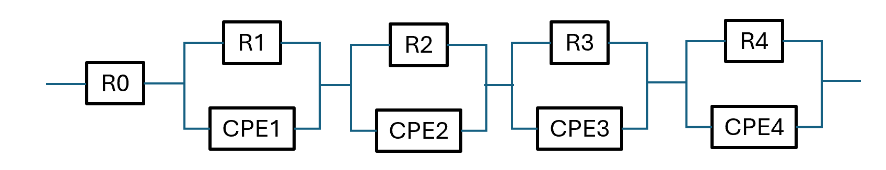
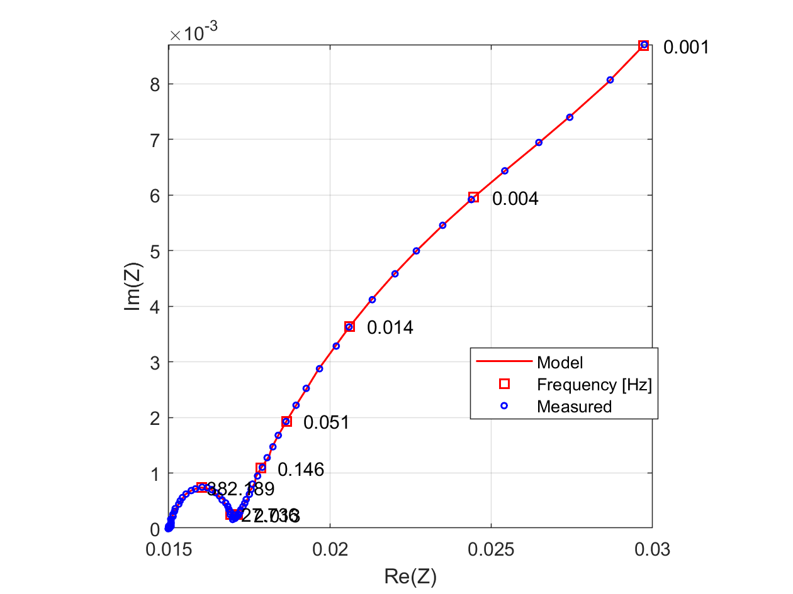
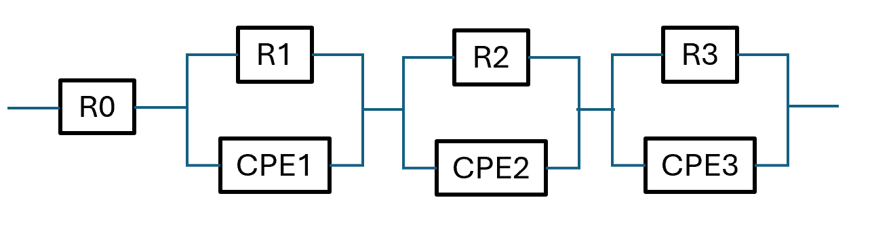
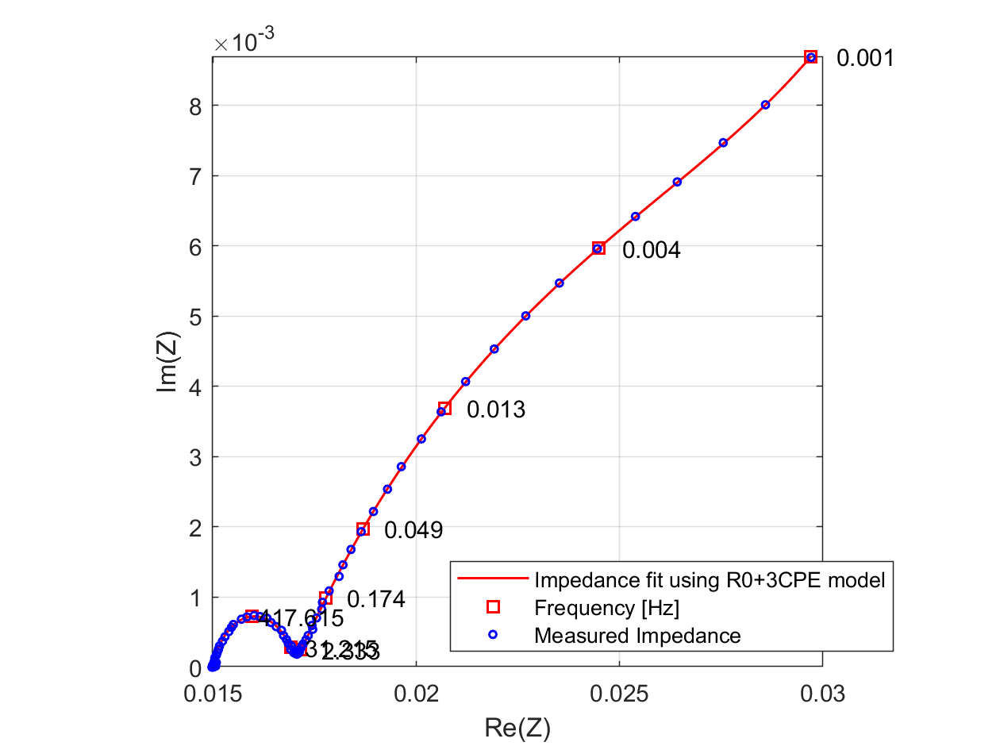
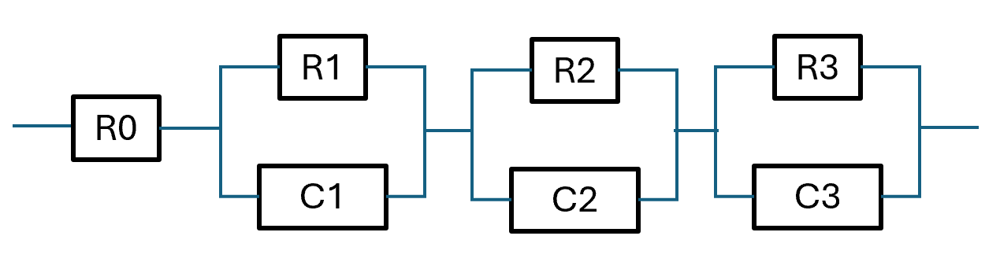
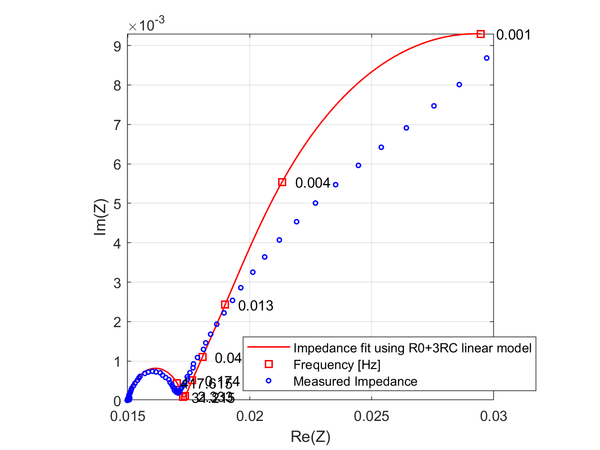
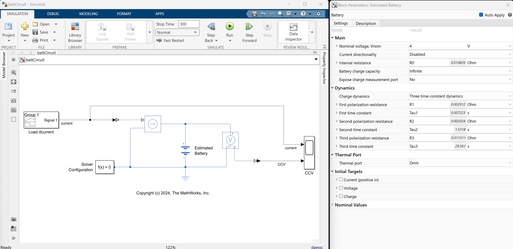
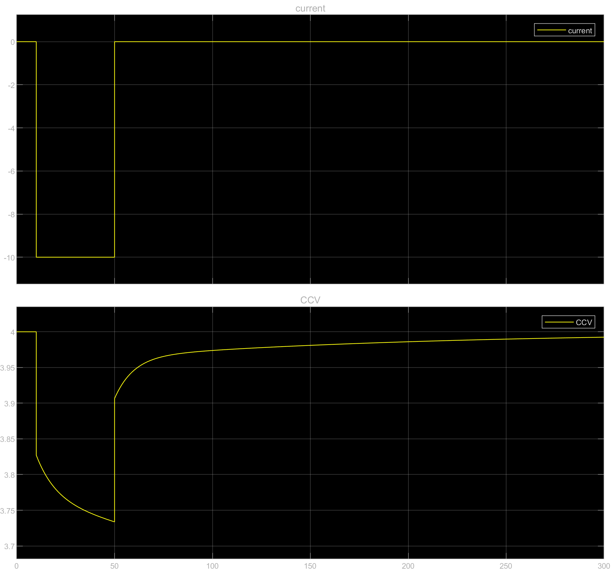

Battery Model Parameter Estimation Using Impedance Data
=======================================================

*Keywords: equivalent circuit model, battery model parameter estimation, impedance data*

Due to the electrification megatrend, estimating battery model parameters using impedance data is of great interest, since typically battery model parameters are estimated using time domain data, and the estimation is usually slow. Additionally, the frequency content of the data measured in time domain may be limited. 

Using [Electrochemical Impedance Spectroscopy (EIS)](https://pubs.acs.org/doi/10.1021/acsmeasuresciau.2c00070) data to directly estimate model parameters is fast and the model may cover a broader frequency range. EIS is basically a frequency response estimation technique based on the perturbation of an electrochemical system in equilibrium or in steady state, via the application of a sinusoidal signal (AC voltage or current) over a wide range of frequencies and the monitoring of the sinusoidal response (current or voltage, respectively) of the system.

This demo uses impedance data of a battery cell to estimate the parameters of an **Equivalent Circuit Model (ECM)**. Estimated model parameters can directly be used for instance in a Simscape™ Battery™ block, such as [Simscape Battery (Table-Based)](https://www.mathworks.com/help/simscape-battery/ref/batterytablebased.html).

Demo contents:

- Discuss the practical frequency range for Li-ion Battery Impedance Spectroscopy
- Explain the Constant Phase Element (CPE)
- Define an electrical circuit for a battery model. The circuit uses CPEs .  Estimate circuit parameters using optimization techniques. Note that a CPE model cannot be simulated in Simulink<sup>®</sup> since it uses a fractional-order derivative.
- Estimating a no-CPE circuit transfer function using a regular linear ECM (such a model can be simulated in Simulink)
- Verify the no-CPE model using Simulink
- Discuss advantages and disadvantages of CPEs for simulation

## Practical Frequency Range for Li-ion Battery Impedance Spectroscopy

Generally, the frequency range for impedance spectroscopy on Li-ion batteries spans from millihertz (mHz) to megahertz (MHz) . Below is a breakdown of the frequency ranges and the corresponding physical processes they represent (for more details, refer to Reference 1):

1. **High Frequencies (10 kHz to 1 MHz or higher):**
   
   - **Inductive effects and ohmic resistance:** At very high frequencies, typically above 10 kHz, the impedance response is dominated by the inductive effects of the cell leads and connectors, as well as the ohmic resistance of the electrolyte and the current collectors. The ohmic resistance (also called the bulk or solution resistance) is associated with the movement of ions in the electrolyte and the electronic resistance of the materials.

2. **Intermediate Frequencies (1 Hz to 10 kHz):**
   
   - **Charge transfer resistance and double-layer capacitance:** In the intermediate frequency range, the impedance spectrum typically shows a semicircle in the Nyquist plot, which corresponds to the charge transfer resistance at the electrode/electrolyte interface and the double-layer capacitance. The charge transfer resistance is related to the kinetics of the electrochemical reactions occurring at the electrode surfaces.
   - **Solid electrolyte interphase (SEI) layer:** The properties of the SEI layer, which forms on the anode surface, can also be probed in this frequency range. The SEI layer affects the impedance response due to its resistive and capacitive characteristics.

3. **Low Frequencies (0.01 Hz to 1 Hz):**
   
   - **Diffusion processes (Warburg impedance):** At low frequencies, the impedance response is influenced by the diffusion of lithium ions within the electrode materials, especially in the solid phase. This is often seen as a linear region with a slope of 45 degrees in the Nyquist plot, known as the Warburg impedance. It reflects the solid-state diffusion of lithium ions in the active material.
   - **Battery relaxation and other slow processes:** Very low frequencies can capture relaxation processes and other slow dynamic phenomena within the battery, such as the redistribution of ions and the stabilization of the SEI layer over longer timescales.

While all three frequency ranges (low, intermediate, and high) provide valuable information, the intermediate frequency range (1 Hz to 10 kHz) is the most important from an application viewpoint, and the reasons are detailed below:

1. **Charge Transfer Resistance and Double-Layer Capacitance:**
   
   - This range is crucial for characterizing the charge transfer resistance and double-layer capacitance at the electrode/electrolyte interface, which are key determinants of battery performance, especially during charging and discharging processes.
   - The charge transfer resistance impacts the overall efficiency and power capability of the battery. A lower charge transfer resistance means better performance and faster charge/discharge rates.

2. **Solid Electrolyte Interphase (SEI) Layer:**
   
   - The SEI layer, which forms on the anode, significantly influences the battery's cycle life and safety. Impedance measurements in this range can provide insights into the quality and stability of the SEI layer.
   - Monitoring changes in the SEI layer over time can help in understanding degradation mechanisms and improving the longevity and reliability of the battery.

3. **Diagnosis and Monitoring:**
   
   - Impedance spectroscopy in the intermediate frequency range is widely used for the state-of-health (SoH) and state-of-charge (SoC) estimation of batteries. These diagnostics are critical for applications where battery reliability and accurate performance assessment are necessary, such as in electric vehicles and grid storage systems.

4. **Optimization and Control:**
   
   - Data from this frequency range can be used to optimize battery management systems (BMS). BMS algorithms often rely on impedance measurements to ensure safe operation, prevent overcharging or deep discharging, and balance the cells within a battery pack.

## The Constant Phase Element (CPE)

The [constant phase element (CPE)](https://en.wikipedia.org/wiki/Constant_phase_element) is a useful model element in electrochemical impedance spectroscopy (EIS) that describes the behavior of non-ideal capacitive systems. In many cases, real systems don't perfectly adhere to the ideal behavior of an ideal capacitor, especially at high frequencies or in the presence of rough or porous surfaces. The CPE model helps to account for these deviations.

In the context of electrochemical systems, the impedance $Z$ of a CPE can be described as:

$Z(\omega) = \frac{1}{{(j\omega)^{\alpha} C_{\text{CPE}}}}$

Where:

- $Z(\omega)$ is the complex impedance at frequency  $\omega$ 
- $j$ is the imaginary unit $( j^2 = -1 )$
- $\omega$ is the angular frequency in rad/s
- $\alpha$ is the phase exponent, which is a measure of non-ideality $(0 ≤\alpha ≤ 1)$
- $C_{\text{CPE}}$is the CPE constant, which represents the effective capacitance of the CPE

The phase exponent,  $\alpha$ , differentiates the CPE from an ideal capacitor. When $\alpha = 1$, the CPE reduces to an ideal capacitor. As $\alpha$ decreases from 1, the CPE behaves more and more like a capacitor at low frequencies. When $\alpha = 0$, the CPE becomes an ideal resistor. 

## Impedance data

This demo uses synthetically generated EIS data, using a circuit model that consists of an ideal resistor R0 in series with four pairs (Resistor, Constant Phase Element) , where the Resistor and Constant Phase Element are connected in parallel. 



To generate the impedance data, the circuit model is tested at 80 frequencies, ranging from 1mHz to 1MHz (0.001 to 1e6 Hz). 

```matlab
% Frequency vector, representing a hypothetical EIS measurement
% from 0.001 Hz to 1e6 Hz
freq_Hz = logspace(-3,6,80)'; % Hz

% The impedance for the R0 + parallel(R_n,CPE_n) , with n = 1..4, circuit
Z = R0 + ...
    R1./(1 + Tau1*(freq*1i).^CPE1factor) + ...
    R2./(1 + Tau2*(freq*1i).^CPE2factor) + ...
    R3./(1 + Tau3*(freq*1i).^CPE3factor) + ...
    R4./(1 + Tau4*(freq*1i).^CPE4factor);

% Make EIS results (add some measurement noise too, to make the synthetic data more realistic)

% Generate a noise vector
noise = 0.05 * max(Z)* randn(length(Z),1);
% add noise
Z = Z.* (1+ noise);

% Extract real and imaginary part of Z
reZ = real(Z);
imZ = imag(Z);

% Save the results
save("ImpedanceData.mat","imZ","reZ","freq");
```

Below figure shows the synthetically generated impedance data.



For details on how the data was generated, please check the MATLAB program **makeEISdata.mlx** 

## Estimate parameters for a battery cell model that uses CPE elements

We consider the following circuit model (note that it is different than the model we used to generate the data):



The impedance of this electric circuit can be written as:

```matlab
Z = R0 + ...
    R1./(1 + Tau1*(freq*1i).^CPE1factor) + ...
    R2./(1 + Tau2*(freq*1i).^CPE2factor) +...
    R3./(1 + Tau3*(freq*1i).^CPE3factor) ;
```

where:

1. **Tau = R*C** represents the time constant of the R-CPE parallel circuit.

2. **1i** is the imaginary unit symbol

3. **freq** is the frequency vector in rad/s

4. **CPEfactor** is the exponent of the fractional-order derivative

The parameters to be estimated are **R1..3, Tau1..3, and CPE1..3 factors**.
Optimization using nonlinear least-squares algorithm (implemented by [lsqnonlin](https://www.mathworks.com/help/optim/ug/lsqnonlin.html)) can be used to quickly estimate the parameters of an arbitrary circuit model.  The cost function used by the optimizer is defined in the function **costFcn**.  

```matlab
function cost = costFcn(params, measReZ, measImZ, freq, weights)
% Define cost function for parameter estimation

% Extract parameters
R0 = params(1);
R1 = params(2);
R2 = params(3);
R3 = params(4);
Tau1 = params(5);
Tau2 = params(6);
Tau3 = params(7);
CPE1factor = params(8);
CPE2factor = params(9);
CPE3factor = params(10);

% Calculate impedance model
Z_model = R0 + ...
    R1 ./ (1 + Tau1 * (freq * 1i) .^ CPE1factor) + ...
    R2 ./ (1 + Tau2 * (freq * 1i) .^ CPE2factor) + ...
    R3 ./ (1 + Tau3 * (freq * 1i) .^ CPE3factor);

% Separate real and imaginary parts
modelReZ = real(Z_model);
modelImZ = imag(Z_model);

% Define penalty for negative parameters or non-ascending time constants
penalty = 0;
if any(params < 0) || Tau1 > Tau2 || Tau2 > Tau3
    penalty = 1e6;
end

% Calculate cost function
cost = [weights .* (modelReZ - measReZ); weights .* (modelImZ - measImZ)] + penalty;
end
```

One thing to notice is that a penalty is used to penalize negative params or time constants not in ascending order. The penalty is used as a soft constraint in the cost definition. Additionally, a weight vector is used to increase the model accuracy in the frequency range of interest. 

```matlab
% Optimization cost function weights
weights = ones(1,length(freq)); % default

% Define weighting function, so that intermediate frequency range is emphasized
% More weight for the frequency range of interest: 1 Hz to 10 kHz
low_threshFreq_Hz = 1; % Hz
hi_threshFreq_Hz = 1e4; % Hz
weights((2*pi*low_threshFreq_Hz<freq)<2*pi*hi_threshFreq_Hz) = 10;
```

It is also very important to set reasonable initial parameter values and search bounds.

Note that we assume that R0 is assumed to be the value where Im(Z) is closest to zero, so R0 is fixed and not estimated during optimization.

```matlab
% we assume that R0 is where ImZ is closest to zero, so R0 is not estimated using optimization

% Find the index of the measImZ value closest to zero
[~, idx] = min(abs(measImZ));
R0 = measReZ(idx)

% Define initial parameters for the optimization
init_params = [
    R0      % R0
    0.005   % R1
    0.01    % R2
    0.02    % R3
    1       % Tau1
    5       % Tau2
    10      % Tau3
    0.5     % CPE1 factor
    0.5     % CPE2 factor
    0.5     % CPE3 factor
    ];

% Search bounds (lower bound, upper bound)
lb =  [R0, 1e-3, 1e-3, 1e-3, 1e-6, 1e-6, 1e-6, 0, 0, 0];
ub =  [R0, 1, 1, 1, Inf, Inf, Inf, 1, 1, 1];
```

Using lsqnonlin solver, we can estimate the R1..3, Tau1..3, and CPE1..3factors, and then check the model frequency response, as shown in below figure. 

```matlab
Local minimum possible.

lsqnonlin stopped because the final change in the sum of squares relative to 
its initial value is less than the value of the function tolerance.

<stopping criteria details>
elapsedTime = 0.6069

Estimated parameters: [0.0150 0.0020 0.0212 0.0703 0.0022 15.6561 3242.8779 0.7844 0.6008 1.0000]
```



As seen from the figure, the fit is very good (for more details, refer to the Live Script **batteryCell_parameterEstimation.mlx**, which is in the project folder). 

However, the main disadvantage of a CPE-based model is that it cannot be simulated in Simulink. To alleviate this, one could try to use a software like [FOMCON](https://www.mathworks.com/matlabcentral/fileexchange/66323-fomcon-toolbox-for-matlab?s_tid=ta_fx_results), which is a third-party toolbox for MATLAB dedicated to fractional-order modeling and control of dynamic systems. FOMCON allows to transform a fractional-order derivative into a regular derivative that can be used in Simulink, using [Oustaloup filters](https://www.mathworks.com/matlabcentral/fileexchange/3802-oustaloup-recursive-approximation-for-fractional-order-differentiators). Such filters are used for analog realization of fractional order derivatives or integrators, by creating a band-limited realization of fractional order (FO) elements. Creating such filters is out of scope for this demo, since it is a relatively difficult task and it may not necessarily increase the accuracy of the fit in the time domain. Besides, the realized analog filters are typically high-order and, to make them usable in a Simscape Battery block, require a model-order reduction step which typically degrade their performance. 

Therefore, instead of relying on CPEs for simulation, for this demo we will directly fit a regular linear transfer function that do not use CPEs and then directly use the model in Simulink. 

## Estimate parameters for a linear ECM

This time we estimate parameters for a battery cell model without CPE elements. We use an R0 + 3 (R-C) linear ECM. Such models are used typically for Li-Ion cell modeling and the estimated parameters can be directly used in the blocks used by the Simscape Battery product, as described further below. However, if the purpose is fitting a MATLAB model only, the model can be arbitrarily changed by using the circuit impedance equation defined in the function **costFcn**.



The impedance of this electric circuit can be written as:

```matlab
Z = R0 + ...
    R1./(1 + Tau1*(freq*1i).^1) + ...
    R2./(1 + Tau2*(freq*1i).^1) +...
    R3./(1 + Tau3*(freq*1i).^1) ;
% where CPEfactor values are all being equal to 1 (ideal capacitor)
```

Note that CPE exponents are all 1, this representing an ideal capacitor. This time, the parameters to be estimated are only **R1..3 and Tau1..3**.

Using lsqnonlin solver, we can estimate the parameters and then check the model frequency response, as shown in below figure.

```matlab
Local minimum possible.

lsqnonlin stopped because the final change in the sum of squares relative to 
its initial value is less than the value of the function tolerance.

<stopping criteria details>
elapsedTime = 0.1035

Estimated parameters: [0.0150 0.0023 0.0059 0.0161 0.0005 9.6659 161.9152 1.0000 1.0000 1.0000 ]
```



The linear system approximation for the impedance data is not as good as the nonlinear CPE-based model, as expected. Nevertheless, the fit quality in the frequency range of interest - the intermediate frequency range  from 1 Hz to 10 kHz - is rather good. And, by tweaking the optimization settings, the weights used in the cost function, or by increasing the number of R-C pairs, it could be possible to obtain even better results. One thing that can cause concern is the difference in the R and Tau parameters obtained by the CPE-based and no-CPE models, however, the values for the CPE-based model are difficult to interpret since they correspond to non-ideal elements.

A major advantage of estimating parameters from frequency domain data is that the parameter estimation is very fast, much faster than estimating parameters from time series data. This enables playing with different circuit models, optimization parameters, cost functions, and so on. As it can be seen from the results above, parameter estimation takes about 0.1 s on a typical laptop PC. A batch parameter estimation program can be created to process impedance values collected at various SOC and temperatures values of the battery cell, so that cell model parameters can be represented as (SOC,Temperature) look-up tables, and used for instance in the [Simscape Battery (Table-Based) model](https://www.mathworks.com/help/simscape-battery/ref/batterytablebased.html). For a typical measurement scenario, where the battery cell is tested at 50 different SOC values and at 10 different ambient temperatures, one would need to perform 50 x 10 = 500 parameter estimation calculations. Considering 0.1 s for each calculation, a full battery cell characterization can be finished in about 50 s, extremely fast compared to parameter estimation using time domain data.

## Check the linear model, using Simulink and Simscape

We can check the linear R0 + 3RC model in simulation, using  **battCircuit** Simulink model. The battery cell model can directly reference the estimated parameters (for details about the model block, please refer to the [Behavioral battery model](https://www.mathworks.com/help/releases/R2023b/simscape-battery/ref/battery.html) documentation page).

We apply a pulse load current of 10 A and observe the dynamics of the battery voltage. The results show the expected dynamic behavior of a typical Li-Ion battery cell CCV.



```matlab
mdl = "battCircuit";

open_system(mdl);

sim(mdl);

open_system(mdl+"/CCV")
```



## Conclusions

- A linear RC pair element needs only two parameters, the R and C values, and the model can be described by a regular transfer function which can be simulated in Simulink. In contrast, if we consider an R-CPE pair, in order to simulate the model in Simulink, we need to transform the CPE element into a regular transfer function. Depending on the order of the approximation, to accurately represent a CPE element one may need a relatively high-order transfer function with a large number of parameters. This makes the usage of CPE problematic, especially when someone is interested in quickly estimating parameters for a typical linear circuit model.

- Until Simulink will natively support fractional-order derivatives (to properly model CPEs), we believe that directly fitting a linear model is more preferable, as it is easier to use the model in the Simscape Battery blocks.

- Optimization using nonlinear least-squares algorithm (implemented by [lsqnonlin](https://www.mathworks.com/help/optim/ug/lsqnonlin.html)) can be used to quickly estimate the parameters of an arbitrary circuit model, and is much faster compared to estimation using time domain data. 

## Getting Started

Follow these steps to download the project and explore the example.

#### Download the submission

* Use the GitHub repository path above and clone it to a local PC directory to save the project files, or 

* Get a local copy of the project directly from MATLAB<sup>®</sup>, by using Simulink<sup>®</sup> ➡ Project from Git

Start the MATLAB<sup>®</sup> project by clicking on the file **BatteryImpedanceStudy_git.prj**. This will load the necessary parameters and then run the simulation by using the MATLAB<sup>®</sup> Live Script **batteryCell_parameterEstimation.mlx**.

#### Start exploring

Open and explore the MATLAB<sup>®</sup> Live Script **batteryCell_parameterEstimation.mlx**. 

## MathWorks<sup>®</sup> products needed to run the demo

1. MATLAB<sup>®</sup> version R2023b or newer
2. Simulink<sup>®</sup>
3. Optimization Toolbox™
4. Control System Toolbox™
5. Simscape™ Battery™ 

## License

The license is available in the LICENSE.txt file in this GitHub repository.


## References

1. P. Liu, G. Ning, and B. Haran, "Frequency Response Analysis of Lithium-Ion Batteries," Journal of The Electrochemical Society, vol. 151, no. 12, pp. A1969-A1973, 2004.
2. [Constant phase element - Wikipedia](https://en.wikipedia.org/wiki/Constant_phase_element) (retrieved at April 4 2024)
3. [FOMCON Toolbox for MATLAB](https://www.mathworks.com/matlabcentral/fileexchange/66323-fomcon-toolbox-for-matlab) (retrieved at April 4 2024)
4. [Oustaloup-Recursive-Approximation for Fractional Order Differentiators](https://www.mathworks.com/matlabcentral/fileexchange/3802-oustaloup-recursive-approximation-for-fractional-order-differentiators) (retrieved at April 4 2024)

*Copyright 2024, The MathWorks, Inc.*
